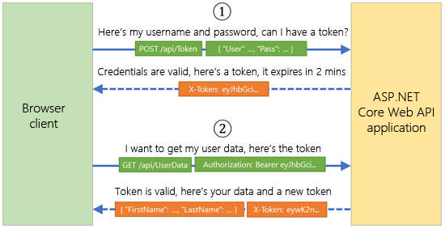
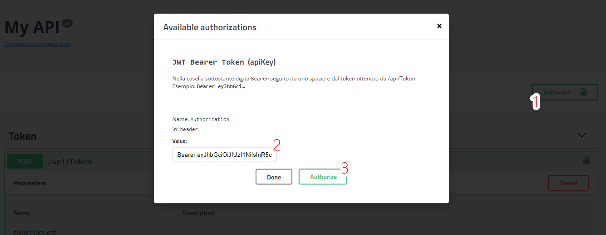
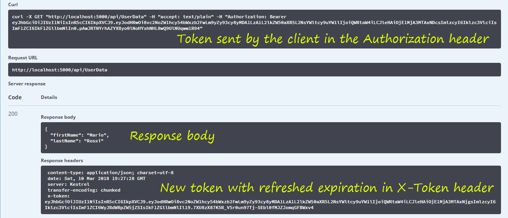

# ASP.Net Core Web Api Jwt Token Demo
An ASP.NET Core Web API application with **short-lived JWT tokens** as an authentication mechanism.

JWT Tokens allow clients to send username and password once in a while (only after a token has expired). This way, a client won't need to store user credentials on the device but just a JWT Token, whose scope is very limited in time.

## Getting started
Follow this steps:
 1. Download and run the application with the `dotnet run` command. The swagger UI interface will appear;
 2. Execute a POST request to the /api/Token endpoint, using `Admin` as the username and `Password` as the password. The server will provide a JWT Token in the `X-Token` response header;
 3. Copy the JWT Token, then click the `Authorize` button that's on top of the page;
 4. Type `Bearer YOUR-JWT-TOKEN` in the textbox and click the green `Authorize` button, then close;
 5. Execute a GET request to the /api/UserData endpoint, and verify it's returning data as long as the token is valid. Notice how a fresh token is sent with each request. Each token has an expiration time of 2 minutes, configurable in the [JwtTokenMiddleware](Middlewares/JwtTokenMiddleware.cs) class. After that (or if you skipped steps 3 and 4), the /api/UserData endpoint will return a 401 Unauthorized error.

Here's a detail of what you should do on step 4. 

## How it works
When the [TokenController](Controllers/TokenController.cs) receives username and password, it verifies those credentials and, if valid, it creates a `ClaimsIdentity` that's set to current HttpContext.

The [JwtTokenMiddleware](Middlewares/JwtTokenMiddleware.cs), just before a response is produced, checks whether an authenticated `ClaimsIdentity` exists. If so, then produces a JWT Token using the claims found in that identity and adds it to the response as a `X-Token` header.
The client must save this token and send it back in a subsequent request in a `Authorization: Bearer TOKEN-HERE` header to prove its identity without actually sending username and password again.

The [UserDataController](Controllers/UserDataController.cs) is protected from anonymous access by the `[Authorize]` attribute. The client will be able to invoke it only when authenticated, that is when providing a valid JWT Token. 

Whenever the client authenticates itself (via username and password or via the provided token), the  [JwtTokenMiddleware](Middlewares/JwtTokenMiddleware.cs) always produces a new JWT Token with a refreshed expiration date and adds it to the `X-Token` response header.

Each token is very short-lived since it's assigned a 2-minute expiration time but this won't prevent a client from using the API for a longer period. In fact, it just needs to send at least a request every 2 minutes in order to receive a new token that will extend the expiration time by another 2 minutes. It's basically a **sliding expiration**.

JWT Tokens sent by the client are validated by the ASP.NET Core Authentication Middleware that's configured in the [Startup](Startup.cs) class.